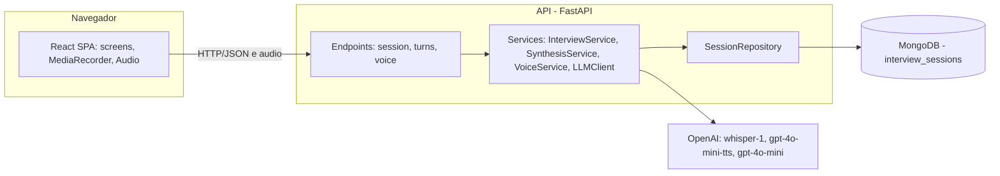
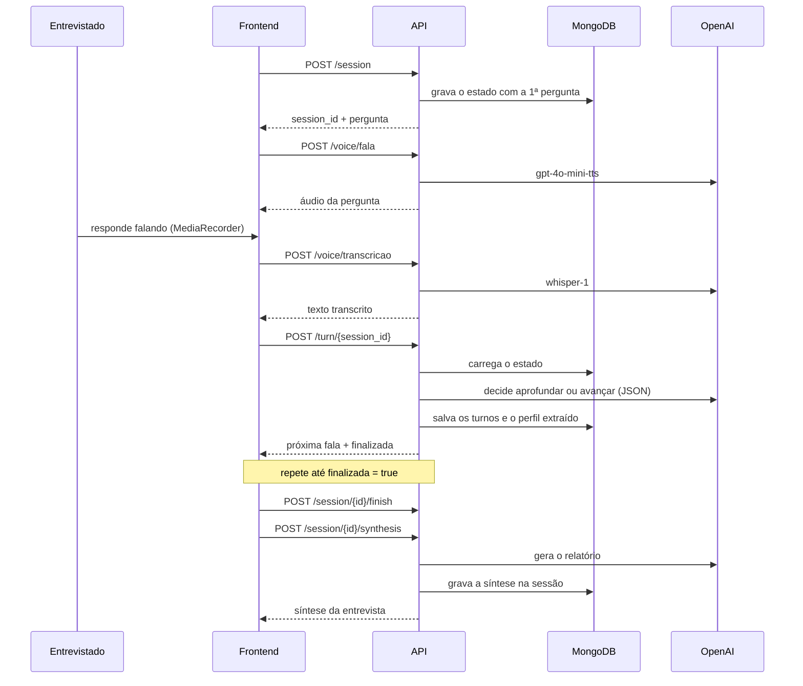
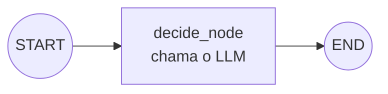
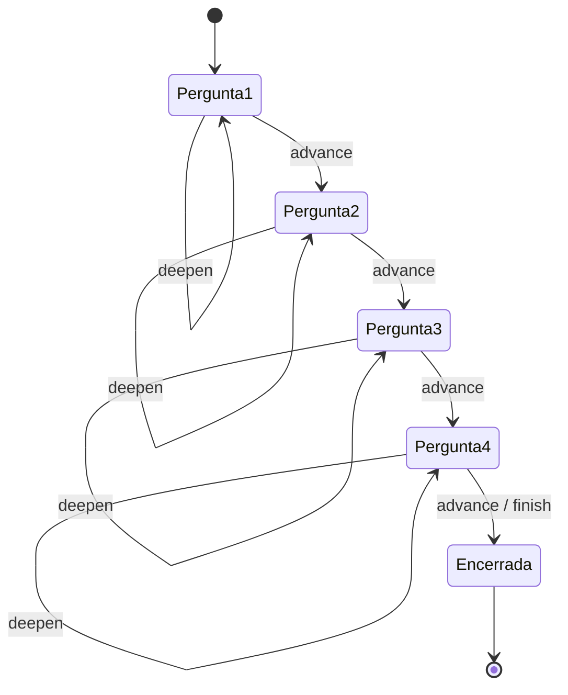

# AEP-ESOFT6SA — Interviewer

Prova de Conceito (PoC) de um **entrevistador generalista conduzido por IA e operado por voz**.
A ferramenta conduz uma entrevista em profundidade sobre qualquer tema, decide a cada resposta se
aprofunda ou avança, e entrega ao final uma síntese estruturada do que foi dito.

---

## 1. Problema

Ouvir pessoas em profundidade é caro. Uma entrevista qualitativa exige entrevistador treinado,
tempo de agenda dos dois lados, transcrição e análise — e cada entrevista adicional custa quase o
mesmo que a primeira. O resultado é que quem desenha políticas públicas, serviços, programas
sociais e pesquisas ouve **poucas pessoas**.

E não são pessoas quaisquer: são as mais fáceis de alcançar. Quem tem tempo livre, quem mora perto
dos centros urbanos, quem responde formulário online, quem escreve com desenvoltura, quem já está
na lista de contatos da organização. Quem está mais distante desse perfil — e que costuma ser
justamente quem mais depende do serviço em discussão — raramente é ouvido. Decisões que afetam
essas pessoas são tomadas a partir do relato de outras.


## 2. ODS atendida — ODS 10: Redução das Desigualdades

A PoC se alinha à **ODS 10** por duas metas específicas:

| Meta | Texto (resumido) | Como a PoC atua |
|---|---|---|
| **10.2** | Promover a inclusão social, econômica e **política** de todos, independentemente de condição econômica, deficiência ou origem | Derruba as duas barreiras que decidem quem é ouvido: o **custo por entrevista**, que cai a quase zero e permite escutar muitas pessoas em vez das mais convenientes, e a **forma de responder**, que passa a ser falar, não escrever |
| **10.3** | Garantir igualdade de oportunidades, inclusive eliminando práticas discriminatórias | Aplica o mesmo protocolo de perguntas a todos os entrevistados, sem a variação de tratamento — no tempo dedicado, no tom, no quanto se insiste — que um entrevistador humano imprime conforme a classe, o sotaque ou a aparência de quem está na frente |

### Como isso aparece na solução

- **Entrevista por voz de ponta a ponta** — a resposta é falada e transcrita
  (`POST /voice/transcricao`), e o entrevistador responde em áudio (`POST /voice/fala`).
  A acessibilidade não é um recurso adicional: é a forma padrão de usar o sistema. Não é preciso
  ler enunciados longos, digitar nem navegar por uma interface densa.
- **Custo marginal próximo de zero** — a entrevista roda sem entrevistador humano, o que muda a
  pergunta de "quem dá para ouvir?" para "quem precisa ser ouvido?".
- **Roteiro generalista e igual para todos** — as perguntas centrais
  (`CORE_QUESTIONS`, em `backend/app/services/interview_service.py`) são neutras de tema e as
  mesmas para qualquer entrevistado, o que torna as respostas comparáveis entre si.
- **Aprofundamento adaptativo** — a cada turno o serviço decide se aprofunda ou avança
  (`InterviewService.run_turn`). Quem responde de forma curta recebe uma nova chance de
  desenvolver, em vez de ter a fala registrada como "sem conteúdo" — o que protege exatamente
  quem não tem repertório de responder pesquisa.
- **Síntese descritiva** — o relatório final organiza o que a pessoa disse, incluindo citações
  diretas, e é instruído a **não inventar informação que não esteja na transcrição**.

### Limites e riscos assumidos

Tecnologia de IA aplicada à escuta também pode **produzir** desigualdade, e a PoC reconhece isso:

- a transcrição automática tem desempenho pior com sotaques regionais e fala fora da norma culta,
  o que degrada o registro justamente de quem se quer ouvir;
- um modelo de linguagem pode carregar viés de classe ao resumir e priorizar o que foi dito;
- o uso depende de microfone e conexão, o que exclui parte do público-alvo;
- a escuta automatizada não substitui a presença de quem conhece o território — ela amplia o
  alcance, não a profundidade do vínculo.

Por isso a síntese descreve o que foi dito e **não emite nota nem juízo sobre a pessoa
entrevistada**.

## 3. Arquitetura

### Visão geral

Três processos e um provedor externo. O frontend é uma SPA que captura e reproduz áudio no
navegador; a API concentra toda a regra de negócio e é o único ponto que fala com a OpenAI; o
MongoDB guarda o estado da entrevista.



### Camadas do backend

| Camada | Pasta | Responsabilidade |
|---|---|---|
| Endpoints | `app/api/v1/endpoints/` | Traduzem HTTP em chamadas de serviço, validam a existência da sessão e devolvem os códigos de erro |
| Injeção de dependência | `app/api/deps.py` | Fábricas usadas pelo `Depends` do FastAPI para montar serviços e repositório |
| Serviços | `app/services/` | Regra de negócio: condução da entrevista, síntese, transcrição e fala, e o acesso ao modelo de linguagem |
| Repositório | `app/repositories/` | Único ponto que conhece a coleção do Mongo; converte documento em `InterviewState` e de volta |
| Esquemas | `app/schemas/` | Modelos Pydantic de entrada, saída e do estado persistido |
| Prompts | `app/prompts/` | Texto dos prompts, separado do código que os executa |

Cada serviço recebe seus colaboradores pelo construtor e cai em um padrão real quando nada é
injetado — `InterviewService(llm_client=None)` constrói um `LLMClient`, `SynthesisService`
constrói repositório e cliente. É isso que permite substituir OpenAI e Mongo por dublês nos
testes sem tocar em rede.

### Endpoints

| Método | Rota | Responsabilidade |
|---|---|---|
| `POST` | `/session` | Cria a sessão, grava a pergunta de abertura e devolve `session_id` |
| `GET` | `/session/{id}` | Estado completo da entrevista |
| `POST` | `/session/{id}/finish` | Encerra a entrevista e registra a fala de encerramento |
| `POST` | `/session/{id}/synthesis` | Gera a síntese e a persiste na própria sessão |
| `POST` | `/turn/{id}` | Processa a resposta do entrevistado e devolve a próxima fala |
| `POST` | `/voice/transcricao` | Áudio (multipart) para texto |
| `POST` | `/voice/fala` | Texto para áudio `audio/mpeg` |
| `GET` | `/health` | Verificação de saúde usada pelo Compose |

### Fluxo de uma entrevista



### Grafo de decisão (LangGraph)

`InterviewService._build_graph` compila o grafo executado a cada turno. Estruturalmente é um
único nó — a política de condução mora inteira no `decide_node`, que lê a última resposta, chama
o LLM e devolve `deepen`, `advance` ou `finish`:



O que interessa de verdade não é a forma do grafo (um nó só), e sim **o que o resultado desse nó
dirige** em `run_turn`: o avanço pelas perguntas centrais de `CORE_QUESTIONS`. É esse loop —
fora do LangGraph, em código comum e testável — que decide se a entrevista aprofunda, avança ou
encerra:



Cada transição é decidida pelo LLM dentro do `decide_node`; o `run_turn` só aplica o efeito
(`current_index += 1`, marca `finished`, anexa o turno) e persiste o estado.

### Decisões de projeto

- **A API não guarda estado em memória.** Todo o progresso da entrevista vive no documento do
  Mongo e é recarregado a cada turno, então qualquer instância da API atende qualquer requisição.
- **A decisão de condução é um grafo.** `InterviewService` compila um grafo LangGraph com o nó
  `decide`, que executa o `DECISION_PROMPT` e devolve `deepen`, `advance` ou `finish` em JSON —
  isolando a política de condução do código que aplica seus efeitos no estado.
- **O SDK da OpenAI aparece em dois lugares apenas.** `LLMClient` (texto e JSON) e `VoiceService`
  (transcrição e fala) encapsulam o SDK; nenhum endpoint o importa.
- **Regras de estado são checadas no servidor.** Responder a uma entrevista encerrada devolve
  `409`, e pedir a síntese antes do encerramento levanta `ValueError`, convertido em `400` pelo
  handler registrado em `app/main.py`.
- **O áudio nunca é armazenado.** A gravação vai para a transcrição e é descartada; só o texto
  persiste.

## 4. Tecnologias

| Camada | Stack |
|---|---|
| Backend | Python 3.11+, FastAPI, Pydantic, LangGraph |
| IA | OpenAI — `whisper-1` (transcrição), `gpt-4o-mini-tts` (voz), modelo de texto para condução e síntese |
| Banco de dados | MongoDB 7 (NoSQL), acesso assíncrono via Motor |
| Frontend | React 18, Vite, React Router, Axios |
| Testes | pytest, pytest-cov |
| Infra | Docker e Docker Compose |
| CI | GitHub Actions (`.github/workflows/backend-ci.yml`) |

## 5. Como executar

### Com Docker Compose (recomendado)

1. Crie o arquivo de ambiente do backend a partir do exemplo:

```bash
cp backend/.env.example backend/.env
```

2. Preencha `OPENAI_API_KEY` em `backend/.env`.

3. Suba os serviços:

```bash
docker compose up --build
```

- Frontend: http://localhost:5173
- API: http://localhost:8000 — documentação em http://localhost:8000/docs
- MongoDB: `mongodb://localhost:27017`

### Localmente, sem Docker

Backend (requer um MongoDB acessível em `MONGO_URI`):

```bash
cd backend && python -m venv .venv && .venv/bin/pip install -r requirements-dev.txt && .venv/bin/uvicorn app.main:app --reload
```

Frontend:

```bash
cd frontend && npm install && npm run dev
```

## 6. Testes e cobertura

Os testes automatizados do backend rodam sem chamadas reais à OpenAI (os clientes são
substituídos por dublês nos testes).

```bash
cd backend && .venv/bin/python -m pytest
```

Para reproduzir a verificação de cobertura mínima usada na CI:

```bash
cd backend && .venv/bin/python -m pytest --cov-fail-under=70
```

O relatório em HTML é gerado em `backend/htmlcov/` com:

```bash
cd backend && .venv/bin/python -m pytest --cov-report=html
```

## 7. Estrutura do projeto

```
backend/
  app/
    api/deps.py         # fábricas de serviços e repositório para o Depends
    api/v1/endpoints/   # rotas: session.py, turns.py e voice.py
    core/config.py      # configurações via variáveis de ambiente
    db/mongodb.py       # cliente Motor e handle do banco
    prompts/            # prompts de condução e de síntese
    repositories/       # SessionRepository: persistência das entrevistas
    schemas/            # modelos Pydantic (InterviewState, Turn, voz)
    services/           # InterviewService, SynthesisService, VoiceService, LLMClient
    main.py             # aplicação FastAPI, CORS e handler de erro
  tests/                # testes automatizados e dublês (conftest.py)
frontend/
  src/
    screens/            # login, boas-vindas, entrevista e devolutiva
    components/         # layout, navegação e avatar
    services/api.js     # cliente axios pré-configurado
```

### Modelo de dados (NoSQL)

A coleção `interview_sessions` guarda o estado completo da entrevista em um único documento,
com **subdocumentos aninhados** — a lista `conversation`, com um objeto por turno da conversa,
e o objeto `profile`, com os dados extraídos do entrevistado ao longo do diálogo:

```json
{
  "session_id": "0b0f9a5e-...",
  "current_index": 2,
  "asked_indices": [0, 1],
  "finished": false,
  "profile": { "ocupacao": "agente comunitária de saúde", "contexto": "zona rural" },
  "conversation": [
    { "role": "interviewer", "text": "Para começar...", "timestamp": "2026-09-10T22:10:00Z" },
    { "role": "participant", "text": "Eu trabalho...", "timestamp": "2026-09-10T22:10:35Z" }
  ]
}
```
